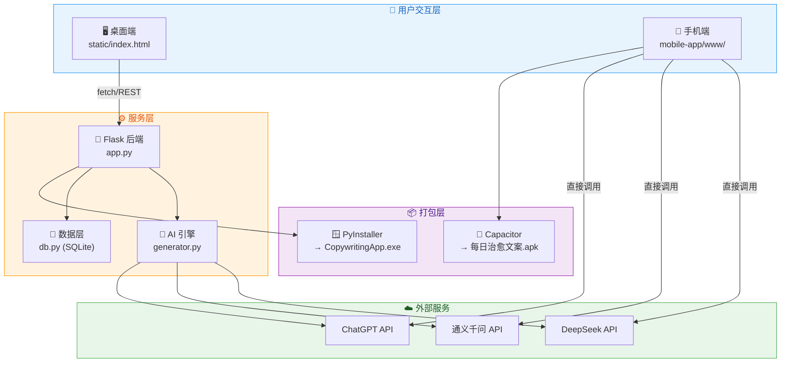

<div align="center">


# 🌸 每日电台 — 治愈文案生成器

### ✨ 一键生成抖音风格治愈文案 · AI 驱动 · 三端通用

[](https://www.python.org/)
[](https://flask.palletsprojects.com/)
[](https://openai.com/)
[](LICENSE)

**📖 文档** · **🚀 快速开始** · **🏗️ 架构设计** · **📱 下载体验**

</div>

---

## 🎯 一句话介绍

> **每日电台** 是一款基于 AI 的治愈系文案自动生成工具，支持 **桌面 EXE**、**浏览器**、**手机 APK** 三端运行，接入 DeepSeek / 通义千问 / ChatGPT 等多种大模型，让每一天的早安晚安都充满温度。

---

## 🌟 核心亮点

<table>
<tr>
<td width="50%" align="center" valign="top">

### 🤖 AI 智能生成

支持 **OpenAI 兼容协议** · `DeepSeek` · `通义千问` · `ChatGPT`

🚀 自动关闭思考模式，速度 **提升 6 倍+**

</td>
<td width="50%" align="center" valign="top">

### 📚 知识库学习

上传 `.docx` / `.pdf` / `.txt` → AI 学习你的文案风格 → ✨ **千人千面**

</td>
</tr>
<tr>
<td width="50%" align="center" valign="top">

### 🌅 双模式切换

**☀️ 早安** 温暖启程 · **🌙 晚安** 卸下疲惫 · 📅 自动匹配日期与星期

</td>
<td width="50%" align="center" valign="top">

### 💻 三端通用

🖥️ 双击 EXE (~27MB) · 🌐 浏览器 localhost · 📱 安装 APK (~3.6MB)

</td>
</tr>
<tr>
<td width="50%" align="center" valign="top">

### 🎨 桌面双栏布局

左侧文案展示 + 右侧配置/知识库/历史，充分利用屏幕空间

</td>
<td width="50%" align="center" valign="top">

### 🔒 完全本地化

💾 SQLite 持久存储 · 🔐 无需联网(除AI) · 📜 历史永久保存 · ⚙️ 配置自动保留

</td>
</tr>
</table>

---

## 🚀 三种运行方式

### 🖥️ 方式一：双击 EXE（推荐新手）

> 零配置，下载即用 🎉

```bash
dist/CopywritingApp.exe    # 双击运行，窗口自动弹出
```

内置 Flask + pywebview，开箱即用。

---

### 🌐 方式二：浏览器访问（推荐开发者）

```bash
pip install -r requirements.txt
python app.py
# → 浏览器打开 http://localhost:5280
```

前端代码修改后刷新即可生效，适合调试。

---

### 📱 方式三：手机 APK 安装

```bash
dist/每日治愈文案.apk    # 传到手机安装
```

也支持 **PWA 安装到主屏**：

```
浏览器访问 → 添加到主屏幕 → 即刻拥有 App 体验
```

---

## 🏗️ 系统架构



---

## 📊 技术栈全景

| 层级 | 技术选型 |
|:----:|----------|
| **后端** | Python 3.11 · Flask · Flask-CORS · APScheduler |
| **AI 引擎** | OpenAI SDK · python-docx · PyPDF2 |
| **桌面前端** | Vanilla HTML/CSS/JS · CSS Variables · Flexbox · PWA |
| **桌面打包** | PyInstaller (--onefile) · pywebview (WebView2) |
| **手机端** | Capacitor 6 · Android SDK 34 · Gradle 8.2.1 |
| **数据持久** | SQLite (桌面) · localStorage (手机) |

---

## 📁 项目目录结构

```
Copywriting Generation/
│
├── 📄 app.py                 # Flask 主服务入口
├── 📄 db.py                  # SQLite 数据库层
├── 📄 generator.py           # AI 文案生成引擎
├── 📄 desktop.py             # pywebview 桌面入口
├── 📄 requirements.txt       # Python 依赖清单
├── 📄 build.bat              # EXE 打包脚本
│
├── 📁 static/                # 桌面前端资源
│   ├── index.html            # 主页面 (双栏响应式布局)
│   ├── manifest.json         # PWA 配置文件
│   ├── sw.js                 # Service Worker 离线缓存
│   └── icons/                # PWA 图标集 (72~512px)
│
├── 📁 data/                  # 运行时数据目录
│   └── copywriting.db        # SQLite 数据库 (自动创建)
│
├── 📁 dist/                  # 构建交付物
│   ├── CopywritingApp.exe    # 🖥️ Windows 桌面版 (~27MB)
│   └── 每日治愈文案.apk       # 📱 Android 手机版 (~3.6MB)
│
└── 📁 mobile-app/            # 手机端 Capacitor 项目
    ├── www/index.html        # 手机端独立前端
    ├── android/              # Android 原生工程
    ├── capacitor.config.json
    └── package.json
```

---

## 🔌 AI 接口兼容列表

本项目使用 **OpenAI 兼容协议**，以下平台均可直接使用：

| 提供商 | Base URL | 推荐模型 | 特色 |
|:-----:|----------|---------|------|
| **OpenAI** | `api.openai.com/v1` | gpt-4o · gpt-4o-mini | 原生支持 |
| **DeepSeek** | `api.deepseek.com` | deepseek-chat | 性价比高 |
| **阿里通义** | `dashscope.aliyuncs.com/.../v1` | qwen-plus · qwen3.5-flash | 中文优化 |
| **硅基流动** | `api.siliconflow.cn/v1` | 多种开源模型 | 免费额度 |

> 💡 **性能提示**：已默认关闭思考模式 (`enable_thinking: false`)，生成速度提升 **6 倍以上**

---

## ⚡ 性能优化历程

| # | 问题现象 | 根因分析 | 解决方案 | 效果 |
|:-:|---------|---------|---------|:----:|
| 1 | 🚫 生成卡死 | `generate()` 无 try-catch | try-catch-finally + AbortController 60s | ✅ 不再卡死 |
| 2 | 🚫 返回 HTML 错误 | 异常返回 Flask 默认错误页 | 全局 `@errorhandler(Exception)` → JSON | ✅ 错误正确显示 |
| 3 | 🚫 EXE 无法使用 | `desktop.py` 未初始化数据库 | 启动前调用 `db.init_db()` | ✅ EXE 正常工作 |
| 4 | 🐢 API 慢 49s | qwen3.5 思考模式开启 | `enable_thinking: False` | ✅ **6倍提速** |
| 5 | 🔄 文案雷同 | Prompt 强制固定格式 | 自由风格 + 多样示例 + temperature=1.0 | ✅ 每次不同 |
| 6 | 🚫 单线程阻塞 | Flask 默认单线程 | `threaded=True` | ✅ 并发不排队 |
| 7 | 🐢 客户端重复创建 | 每次新建 OpenAI Client | `_client_cache` 缓存复用 | ✅ 省 ~200ms/次 |

---

## 🛠️ 开发指南

<details open>
<summary><b>📦 打包 Windows EXE</b></summary>

```bash
# 创建虚拟环境 & 安装依赖
python -m venv venv311
.\venv311\Scripts\activate
pip install -r requirements.txt

# PyInstaller 打包
.\venv311\Scripts\pyinstaller.exe --noconfirm --onefile --windowed ^
  --name "CopywritingApp" ^
  --add-data "static;static" ^
  --hidden-import=flask --hidden-import=flask_cors ^
  --hidden-import=openai --hidden-import=apscheduler ^
  --hidden-import=docx --hidden-import=PyPDF2 ^
  --hidden-import=pywebview ^
  desktop.py

# 输出 → dist/CopywritingApp.exe
```

</details>

<details>
<summary><b>📦 打包 Android APK</b></summary>

```bash
cd mobile-app
npm install
npx cap sync android

# 设置环境变量后构建
# JAVA_HOME=E:\configuration\Java\jdk21
# ANDROID_HOME=C:\Users\<用户>\AppData\Local\Android\Sdk
gradle assembleDebug --no-daemon

# 输出 → android/app/build/outputs/apk/debug/app-debug.apk
```

</details>

<details>
<summary><b>🔧 本地开发调试</b></summary>

```bash
# 启动服务 (多线程模式)
python app.py
# → http://localhost:5280

# 或指定端口
python -c "
from app import app, db
db.init_db()
app.run(host='127.0.0.1', port=5280, debug=False, threaded=True)
"
```

</details>

---

## 📋 核心模块说明

| 模块 | 文件 | 职责描述 |
|:---:|------|---------|
| 🔧 **Web 后端** | `app.py` | Flask RESTful API · 文件解析 · PWA · 全局错误处理 |
| 🧠 **AI 引擎** | `generator.py` | Prompt 构建 · OpenAI SDK · 客户端缓存 · 本地降级 |
| 💾 **数据层** | `db.py` | SQLite CRUD · PyInstaller 路径兼容 · 自动建表 |
| 🪟 **桌面入口** | `desktop.py` | pywebview 窗口 · 自动端口分配 · 数据库初始化 |
| 🖥️ **桌面前端** | `static/index.html` | 双栏响应式布局 · 拖拽上传 · Toast 提示 |
| 📱 **手机前端** | `mobile-app/www/index.html` | 移动端 UI · localStorage · JSZip/pdf.js |

---

<p align="center">
  
  &nbsp;
  
  &nbsp;
  
</p>
